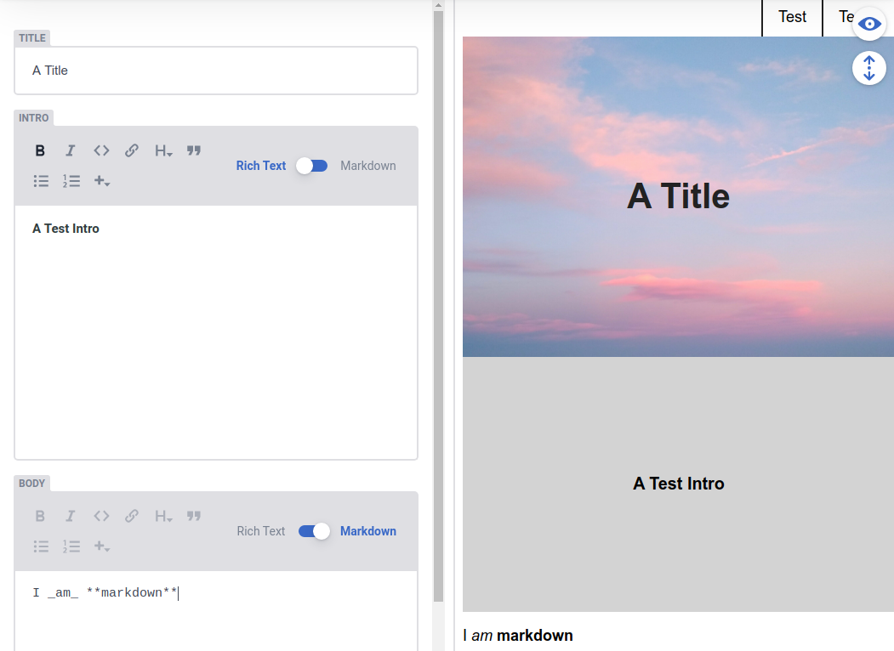

# Eleventy x Netlify CMS starters

A 11ty starter with Netlify CMS integration.

## Features

* Styles compiled with `sass` and `gulp`
  * Inject critical styles into the html `head`
* JavaScript bundled with `rollup`
* Automatic responsive images using `eleventy-plugin-local-respimg`
* Integration with Netlify CMS including previews

## Adding a new page

1. Register the page in `src/content/admin/config.yml` 
2. Add a new layout for the collection or page in `src/_includes/layouts`
3. Register the layout in `src/scripts/admin.js`

